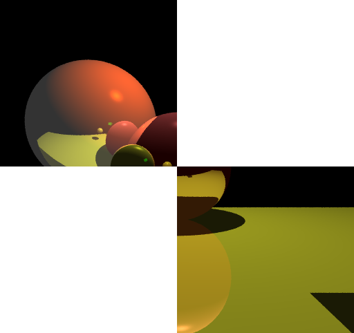

# Calculs parallèles

## Préambule

Maintenant que vous avez développé différentes applications réparties dans différentes situations, nous terminons par cet ultime projet qui illustrera un nouvel aspect de la programmation répartie : **le calcul parallèle**. Il se décline sous différentes formes, et nous verrons ici sa forme la plus simple, la **parallélisation des données**. Ici, on souhaite réaliser un traitement impossible à réaliser sur un ordinateur personnel pour manque de puissance de calcul. Ayant accès à un ensemble de machines, nous décidons de découper ce gros calcul en petits morceaux et de les transmettre à ces machines. Elles calculeront et renverront chacune une partie du résultat. Il faudra ensuite assembler les différents morceaux pour obtenir le résultat final.

> ### Question
> En utilisant votre meilleur outil, votre imagination, décrivez et illustrez comment cela pourrait être réalisé, sans rentrer dans les détails JAVA, que vous n'allez pas tarder à mettre en œuvre.

---

## Le tracé de rayon (*raytracing*)

Nous vous proposons un type de calcul très gourmand en cycles CPU : *la synthèse d'images*. Avant l'avènement de Dall.E ou de Stable Diffusion auxquelles on demande en quelques phrases de nous créer une œuvre sortie de leur imagination, synthétiser une image nécessitait un calcul fastidieux, qui a été plus tard délégué à des processeurs dédiés, les GPU. Il fallait souvent décrire une scène non pas en langage naturel mais sous la forme d'un ensemble de formes géométriques et de sources lumineuses. L'algorithme de synthèse d'image calculait la scène pixel par pixel, pour enfin produire une image.

L'**archive fournie**, est une implantation naïve en JAVA d'un tel algorithme. La scène calculée est décrite dans le fichier `simple.txt`.

### Questions

1. Tester le programme en modifiant ses paramètres (sur la ligne de commande).
2. Observer le temps d'exécution en fonction de la taille de l'image calculée. Vous pouvez faire une courbe (temps de calcul et tailles d'image).
3. En ne modifiant **que** le fichier `LancerRaytracer.java`, reproduire l'image suivante :

---

## Accélérons les choses

Vous constatez rapidement que pour calculer une image de bonne résolution il faut s'armer de patience. Pour cela nous allons devoir paralléliser les calculs sur un ensemble de machines. Dans notre scénario nous disposons de :

* Un ensemble de nœuds de calcul, capables de calculer un morceau d'une scène.
* Un serveur de nœuds qui nous permet de récupérer les coordonnées des nœuds de calcul.
* Un programme qui découpe le calcul, récupère les coordonnées des nœuds disponibles, envoie un calcul sur chacun et affiche le résultat.

### Questions

* **Faire un petit schéma de cette architecture en identifiant les choses suivantes :**
  1. Le/les processus fixes (ceux qui écoutent sur un port choisi) et les processus mobiles ? (ceux qui rentrent et sortent à leur guise) ?
  2. Les types des données échangées entre les processus.
* **Si on veut que les calculs se fassent en parallèle que faut-il faire ?**
* **Lancez-vous et réalisez cette application répartie !** Vérifiez que le calcul est bien accéléré.